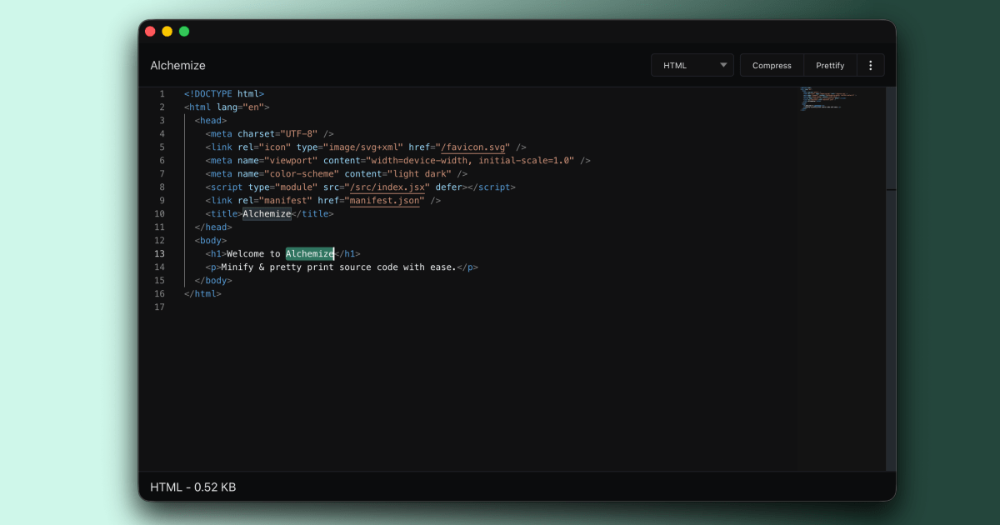

# Alchemize

Sometimes you just need to minify or pretty-print your code. Enter: Alchemize, your one app for dealing with code on the web.

Alchemize supports:

- Minifying & pretty-printing HTML & CSS
- Minifying/compressing Javacript
- Decompressing/pretty-printing minified Javacript
- Compress & pretty-print XML, JSON

You can always use the latest version at [alchemizeapp.com/app](https://alchemizeapp.com/app/) or install the extension from the [Chrome Web Store](chrome.google.com/webstore/detail/alchemize/ehjicobhjldomnjicohkkejcgljecncf).

## Building/development

This project now uses [Vite](https://vitejs.dev/) as its build platform.

Prereqs:

- Node
- npm

To install:

1. Check out the repo.
2. `npm install` the dependencies.
3. `npm run dev` will start the development server with hot reloading

## Adding a new language

The prettify and minify functions are implemented in separate files for each supported language.
These modules can be found in [`src/converters/`](src/converters).

All functions are asynchronous and called through a worker service ([`converterWorker.js`](src/converters/converterWorker.js)) that handles different language types and determines whether to compress or prettify based on input parameters.

## Bugs & errata

Please feel free to report bugs & feature requests on the GitHub issue tracker. Pull requests are welcome indeed.
